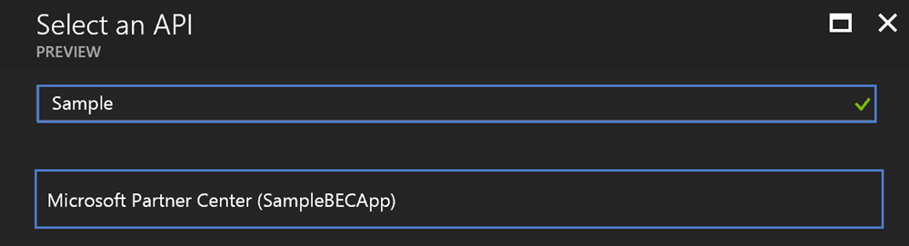
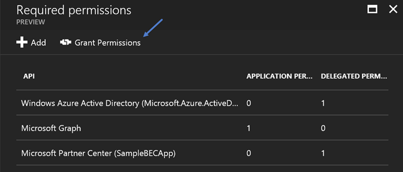

# Partner Center Bot
This is a sample project that demonstrates how to leverage the Microsoft Bot framework to construct a bot that interacts with Partner Center. With this initial release limited
features are supported. Additional abilities will be added over time. The intent of this project is not to provide a fully functional bot, but rather to demonstrate how this 
technology can be utilize to support customers. Most customers want the ability to resolve issues on their own, and this sample provides you a tool that can help fufill that
desire.

__Current Build Status:__ 

### Prerequisites 
The following are _optional_ prerequisites for this sample project 

| Prerequisite          | Purpose                                                                                                      |
|-----------------------|--------------------------------------------------------------------------------------------------------------|
|  Azure Subscription   | A subscription is only required if you want to host the sample in Azure and utilize the Redis Cache feature. |

The following are _required_ prerequisites for this sample project

| Prerequisite                           | Purpose                                                                                     |
|----------------------------------------|---------------------------------------------------------------------------------------------|
|  Azure AD global admin privileges      | Required to create the required Azure AD application utilized to obtain access tokens.      |
|  Partner Center admin agent privileges | Required to perform various Partner Center operations through the Partner Center API.       |

### Creating the Azure AD Application for Partner Center API Access
To access the Partner Center API an application must be registered and configured with the partner's Azure AD tenant. Perform the following tasks to create and configure the 
application

1. Login into https://partnercenter.microsoft.com using credentials that have both _AdminAgent_ and _Global Admin_ privileges
2. Click _Dashboard_ -> _Account Settings_ -> _App Management_ 
3. Click on _Register existing app_ if you want to use an existing Azure AD application, or click _Add new web app_ to create a new one

	

4. Document the _App ID_ and _Account ID_ values. Also, if necessary create a key and document that value. 

	

It is important to understand that the creation and configuration of this Azure AD application can be done from the Azure Management portal. However,since this sample utilize 
*app only* authentication to access the Partner Center API the application must be registred in Partner Center using this process. Otherwise, you will receive a HTTP 401 error
with every attempt to access the Partner Center API.

### Creating the Bot Azure AD Application
The bot requires an Azure AD application that grants privileges to Azure AD and the Microsoft Graph. Perform the following tasks to create and configure the application 

1. Login into the [Azure Management portal](https://portal.azure.com) using credentials that have _Global Admin_ privileges
2. Open the _Azure Active Directory_ user experince and then click _App registration_

	

3. Click _+ Add_ to start the new application wizard
4. Specify an appropriate name for the bot, select _Web app / API_ for the application, an appropriate value for the sign-on URL, and then click _Create_
5. Click _Required permissions_ found on the settings blade for the the application and then click _+ Add_ 
6. Add the _Microsoft Graph_ API and grant it the _Read directory data_ application permission
7. Add the _Partner Center API_  and grant it the _Access Partner Center PPE_ delegated permission

	

8. Click _Grant Permissions_, found on the _Required Permissions_ blade, to consent to the application for the reseller tenant 

    

### Configuring the Application for Pre-consent
Perform the following steps to configure the application that will be used to access the Partner Center API for pre-consent 

1. Install Azure AD PowerShell Module (instruction available [here](https://docs.microsoft.com/en-us/powershell/azuread/)).
2. Update the _AppId_ and _DisplayName_ variables in the PowerShell script below
3. Execute the modified PowerShell script. When prompted for authentication specify credentials that belong to the tenant where the application was created and that have global 
admin privileges  

```powershell
Connect-AzureAD

$AppId = 'INSERT-APPLICATION-ID-HERE'
$DisplayName = 'INSERT-APPLICATION-DISPLAY-NAME-HERE'

$g = Get-AzureADGroup | ? {$_.DisplayName -eq 'AdminAgents'}
$s = Get-AzureADServicePrincipal | ? {$_.AppId -eq $AppId}

if ($s -eq $null) { $s = New-AzureADServicePrincipal -AppId $AppId -DisplayName $DisplayName }
Add-AzureADGroupMember -ObjectId $g.ObjectId -RefObjectId $s.ObjectId
```

## Code of Conduct 
This project has adopted the [Microsoft Open Source Code of Conduct](https://opensource.microsoft.com/codeofconduct/). For more 
information see the [Code of Conduct FAQ](https://opensource.microsoft.com/codeofconduct/faq/) or contact 
[opencode@microsoft.com](mailto:opencode@microsoft.com) with any additional questions or comments.

## License
Copyright (c) Microsoft Corporation. All rights reserved.

Licensed under the [MIT](LICENSE) License.